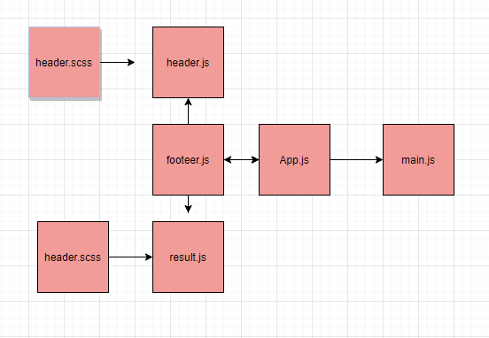

# RESTyAPP

## Description

convert class components to an application written using React function components so that our foundation is both stable and high performing.

## Setup:

* To create a react app: npx create-react-app app-name
* To start the app: npm start
* To use Sacc for styling: npm i node-sass

## netlify link
https://mystifying-ritchie-5208a9.netlify.app/

## sandbox link

https://codesandbox.io/s/xenodochial-sun-2mm4n

## pull request

https://github.com/baraahalomari/resty/pull/1

https://github.com/baraahalomari/resty/pull/6

## UML Diagram

